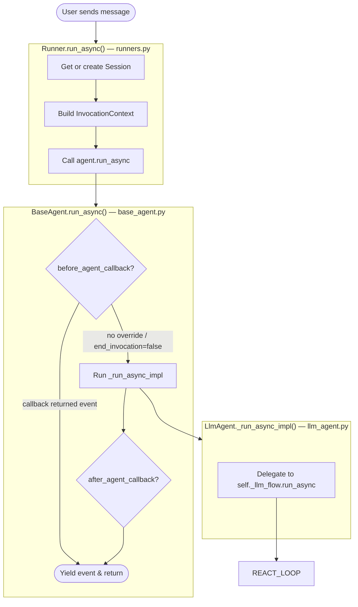

# Google ADK — Internal ReAct Loop Flowchart

This document describes the detailed internal **ReAct (Reason + Act)** loop of
an AI agent as implemented by the Google Agent Development Kit (ADK) Python
library. The flowchart traces the full execution path from `Runner.run_async()`
down through the core loop in `BaseLlmFlow`, LLM invocation, tool execution,
and loop termination.

## Source File References

| Layer | File | Key Lines |
|---|---|---|
| Entry point | `src/google/adk/runners.py` | `run_async()` ~L452 |
| Base agent | `src/google/adk/agents/base_agent.py` | `run_async()` ~L271 |
| LLM agent | `src/google/adk/agents/llm_agent.py` | `_run_async_impl()` ~L448 |
| Core ReAct loop | `src/google/adk/flows/llm_flows/base_llm_flow.py` | `run_async()` ~L420 |
| Single step | `src/google/adk/flows/llm_flows/base_llm_flow.py` | `_run_one_step_async()` ~L435 |
| LLM call | `src/google/adk/flows/llm_flows/base_llm_flow.py` | `_call_llm_async()` ~L877 |
| Post-processing | `src/google/adk/flows/llm_flows/base_llm_flow.py` | `_postprocess_async()` ~L657 |
| Function calls | `src/google/adk/flows/llm_flows/base_llm_flow.py` | `_postprocess_handle_function_calls_async()` ~L824 |
| Tool execution | `src/google/adk/flows/llm_flows/functions.py` | `handle_function_calls_async()` ~L333 |
| Final response check | `src/google/adk/events/event.py` | `is_final_response()` ~L82 |

---

## High-Level Overview

---

## Detailed ReAct Loop

```mermaid
flowchart TD
    START([Enter BaseLlmFlow.run_async]) --> LOOP_TOP

    %% ── Main while-True loop ──────────────────────────────
    LOOP_TOP["while True:"] --> ONE_STEP

    subgraph ONE_STEP ["_run_one_step_async()  — one LLM round-trip"]

        direction TB

        %% ── 1. PREPROCESS ────────────────────────────────
        PRE["<b>① PREPROCESS</b><br/>_preprocess_async()"]
        PRE_DETAIL["• Run request_processors<br/>• Resolve toolset auth<br/>• Prepare tools for LLM request"]
        PRE --> PRE_DETAIL

        PRE_DETAIL --> END_INV_CHECK1{end_invocation?}
        END_INV_CHECK1 -- yes --> STEP_RETURN([return from step])
        END_INV_CHECK1 -- no --> RESUME_CHECK

        %% ── 1b. Resumable invocation check ───────────────
        RESUME_CHECK{Resumable &<br/>pending long-running<br/>tool calls?}
        RESUME_CHECK -- yes, paused --> STEP_RETURN
        RESUME_CHECK -- yes, has fn calls<br/>to resume --> HANDLE_FC_RESUME["Execute pending<br/>function calls<br/>(skip LLM call)"]
        HANDLE_FC_RESUME --> STEP_RETURN
        RESUME_CHECK -- no --> CALL_LLM

        %% ── 2. CALL LLM (Reason) ─────────────────────────
        CALL_LLM["<b>② CALL LLM  (Reason)</b><br/>_call_llm_async()"]

        subgraph LLM_CALL_DETAIL ["_call_llm_async() internals"]
            direction TB
            BMC{before_model_callback?}
            BMC -- callback returned<br/>LlmResponse --> AMC
            BMC -- no override --> INC_COUNT["Increment LLM call counter<br/>(enforce max_llm_calls)"]
            INC_COUNT --> GEN["llm.generate_content_async()<br/>― send request to model ―"]
            GEN --> TRACE["Trace LLM call"]
            TRACE --> AMC{after_model_callback?}
            AMC -- altered response --> YIELD_LLM_RESP
            AMC -- no change --> YIELD_LLM_RESP["Yield LlmResponse"]
        end

        CALL_LLM --> LLM_CALL_DETAIL

        %% ── 3. POSTPROCESS ───────────────────────────────
        YIELD_LLM_RESP --> POST["<b>③ POSTPROCESS</b><br/>_postprocess_async()"]

        subgraph POST_DETAIL ["_postprocess_async() internals"]
            direction TB
            RP["Run response_processors"]
            RP --> EMPTY_CHECK{Response has<br/>content?}
            EMPTY_CHECK -- no content &<br/>no error --> POST_SKIP([skip — no event])
            EMPTY_CHECK -- yes --> BUILD_EVT["Build model_response_event<br/>(finalize content, actions, etc.)"]
            BUILD_EVT --> YIELD_MODEL_EVT["<b>Yield model_response_event</b><br/>to caller"]
            YIELD_MODEL_EVT --> FC_CHECK{Event contains<br/>function_calls?}
            FC_CHECK -- no --> POST_DONE([done — text-only response])
            FC_CHECK -- yes --> HANDLE_FC
        end

        POST --> POST_DETAIL

        %% ── 4. HANDLE FUNCTION CALLS (Act) ───────────────
        HANDLE_FC["<b>④ EXECUTE TOOLS  (Act)</b><br/>_postprocess_handle_function_calls_async()"]

        subgraph TOOL_EXEC ["Tool Execution  — functions.py"]
            direction TB
            CREATE_TASKS["Create async task per function_call"]
            CREATE_TASKS --> PARALLEL["asyncio.gather()<br/>— parallel execution —"]

            subgraph SINGLE_TOOL ["Per-tool execution pipeline"]
                direction TB
                BTC{before_tool_callback?}
                BTC -- override --> AFTER_TOOL
                BTC -- no override --> CALL_TOOL["await tool.run_async()<br/>― execute the tool ―"]
                CALL_TOOL -- success --> AFTER_TOOL
                CALL_TOOL -- exception --> ERR_CB{on_tool_error<br/>callback?}
                ERR_CB -- handled --> AFTER_TOOL
                ERR_CB -- not handled --> RAISE([raise exception])
                AFTER_TOOL{after_tool_callback?}
                AFTER_TOOL -- altered response --> TOOL_RESULT
                AFTER_TOOL -- no change --> TOOL_RESULT["Tool result ready"]
            end

            PARALLEL --> SINGLE_TOOL
            SINGLE_TOOL --> MERGE["Merge parallel results<br/>into single Event"]
        end

        HANDLE_FC --> TOOL_EXEC

        %% ── 5. Post-tool checks ──────────────────────────
        MERGE --> AUTH_CHECK{Auth required<br/>by any tool?}
        AUTH_CHECK -- yes --> YIELD_AUTH["Yield auth_request event<br/>(interrupts loop)"]
        AUTH_CHECK -- no --> CONFIRM_CHECK

        CONFIRM_CHECK{Tool confirmation<br/>required?}
        CONFIRM_CHECK -- yes --> YIELD_CONFIRM["Yield confirmation event"]
        CONFIRM_CHECK -- no --> YIELD_FC_RESP

        YIELD_AUTH --> YIELD_FC_RESP
        YIELD_CONFIRM --> YIELD_FC_RESP

        YIELD_FC_RESP["<b>Yield function_response_event</b><br/>(tool results fed back to session)"]

        YIELD_FC_RESP --> TRANSFER_CHECK{transfer_to_agent<br/>in response?}
        TRANSFER_CHECK -- yes --> AGENT_TRANSFER["Recursively call<br/>target_agent.run_async()<br/>(sub-agent gets its own ReAct loop)"]
        TRANSFER_CHECK -- no --> STEP_END([Step complete])
        AGENT_TRANSFER --> STEP_END
    end

    %% ── Loop continuation decision ───────────────────────
    STEP_END --> LOOP_DECISION

    LOOP_DECISION{{"last_event.is_final_response()?"<br/><i>True when: no function_calls,<br/>no function_responses,<br/>not partial, no trailing code exec</i>}}

    LOOP_DECISION -- "yes → final text answer" --> DONE
    LOOP_DECISION -- "no → tool results need<br/>another reasoning pass" --> LOOP_TOP

    POST_DONE --> LOOP_DECISION2{{"last_event.is_final_response()?"}}
    LOOP_DECISION2 -- yes --> DONE
    LOOP_DECISION2 -- no --> LOOP_TOP

    DONE([Return to caller — invocation complete])

    %% ── Styling ──────────────────────────────────────────
    classDef reason fill:#4a90d9,stroke:#2c5f8a,color:#fff
    classDef act fill:#e8833a,stroke:#b35f1e,color:#fff
    classDef decision fill:#f5d76e,stroke:#c5a83b,color:#333
    classDef event fill:#7ec87e,stroke:#4a8a4a,color:#333

    class CALL_LLM,GEN,BMC,AMC,INC_COUNT reason
    class HANDLE_FC,CALL_TOOL,BTC,AFTER_TOOL,ERR_CB,CREATE_TASKS,PARALLEL act
    class LOOP_DECISION,LOOP_DECISION2,FC_CHECK,TRANSFER_CHECK,AUTH_CHECK,CONFIRM_CHECK,END_INV_CHECK1,RESUME_CHECK,EMPTY_CHECK decision
    class YIELD_MODEL_EVT,YIELD_FC_RESP,YIELD_AUTH,YIELD_CONFIRM event
```

---

## Loop Termination Conditions

The `while True` loop in `BaseLlmFlow.run_async()` (line ~L424) breaks when `last_event.is_final_response()` returns `True`. That method
(`event.py:82`) returns `True` when **all** of the following hold:

| Condition | Meaning |
|---|---|
| `not self.get_function_calls()` | Model did **not** request any tool calls |
| `not self.get_function_responses()` | No pending function responses |
| `not self.partial` | Not a streaming partial chunk |
| `not self.has_trailing_code_execution_result()` | No code-execution output pending |

Or unconditionally `True` when:
- `self.actions.skip_summarization` is set, or
- `self.long_running_tool_ids` is non-empty (invocation paused for async tool)

---

## Key Design Characteristics

1. **Async generators throughout** — Every layer yields `Event` objects as they
   are produced; nothing is buffered. This enables streaming to callers.

2. **Parallel tool execution** — When the LLM requests multiple tool calls in a
   single response, all tools run concurrently via `asyncio.gather()`.

3. **Six-stage tool callback pipeline** — Each tool call passes through:
   plugin `before_tool` → agent `before_tool` → **actual tool** →
   plugin `after_tool` → agent `after_tool` → (error callbacks on failure).

4. **Agent transfer** — A tool can set `transfer_to_agent` in its response
   actions. The framework then recursively invokes the target agent's full
   `run_async()` cycle, giving it its own ReAct loop.

5. **Resumability** — Long-running tools can pause the invocation. On resume,
   the loop skips the LLM call and directly executes the pending function calls.

6. **Callback short-circuits** — `before_model_callback` can return a synthetic
   `LlmResponse` to skip the actual LLM call entirely. `before_tool_callback`
   can return a synthetic tool result to skip actual tool execution.
